# 🚀 Boom OTT GCP Infrastructure (Terraform)

Welcome to the **Boom OTT Infrastructure** repository. This project contains the infrastructure-as-code (IaC) configurations written in Terraform to provision the foundational Google Cloud Platform (GCP) resources required to run the Boom Over-The-Top (OTT) streaming application.

This repository orchestrates a secure, highly-available, and auto-scaling production environment by leveraging **Google Kubernetes Engine (GKE)**, secure **VPC Networking**, **IAM Workload Identity**, and automated GitOps continuous delivery via **ArgoCD**.

---

## 🏗️ Architecture Overview

The infrastructure is designed with a **security-first, private-by-default** topology.

```mermaid
graph TD
    subgraph GCP ["Google Cloud Platform (GCP)"]
        subgraph VPC ["Boom OTT Custom VPC Network (10.0.0.0/16)"]
            subgraph PrivateSubnet ["Private Subnet (10.0.0.0/16)"]
                GKE["GKE Private Cluster"]
                NAT["Cloud NAT Gateway"]
                Router["Cloud Router"]
            end
            
            subgraph PublicAccess ["Public Load Balancer Ingress"]
                LB["HTTP(S) Load Balancer"]
            end
        end
        
        subgraph IAM ["IAM & Workload Identity"]
            NodeSA["GKE Node Service Account"]
            WorkloadSA["App Workload Identity SA"]
        end
    end
    
    subgraph K8sCluster ["GKE Cluster Internal"]
        ArgoCD["ArgoCD Namespace"]
        App["Boom OTT Application Namespace"]
    end
    
    Internet((Internet)) <--> LB
    LB <--> GKE
    GKE <--> K8sCluster
    GKE -.-> NodeSA
    App -.-> WorkloadSA
    NAT <--> Router
    Router <--> Internet
```



### 🛰️ Core Infrastructure Components

1. **Custom VPC Network (`modules/network`)**
   - Non-overlapping custom subnets with dedicated secondary ranges for **GKE Pods** (`10.1.0.0/16`) and **GKE Services** (`10.2.0.0/20`).
   - A **Cloud NAT Gateway** and **Cloud Router** to allow secure, egress-only internet access for private GKE nodes (e.g., to pull container images or fetch system updates).
   - Firewall rules restricting traffic and keeping communication secure.
   - Pre-configured VPC Peering for secure private services access (reserved range `10.0.0.0/16`).

2. **Google Kubernetes Engine (`modules/gke`)**
   - A fully private GKE cluster where Kubernetes master nodes communicate with the worker nodes via dedicated internal IPs.
   - An autoscaling, separately-managed node pool running stable `e2-standard-2` machine types that scales dynamically from 1 to 5 nodes.
   - **Workload Identity** enabled (`${project_id}.svc.id.goog`) to bind Kubernetes Service Accounts (KSAs) to Google Service Accounts (GSAs), completely eliminating the need for static, long-lived IAM service account keys.
   - Auto-repair and auto-upgrade policies enabled to keep nodes healthy and secure.

3. **Identity & Access Management (`modules/iam`)**
   - **GKE Node Service Account**: Minimum-privilege service account strictly limited to log-writing, monitoring metrics, and Stackdriver resource metadata writing.
   - **Workload Identity Service Account**: Bound directly to the OTT application's Kubernetes Service Account (`default/boom-ott-app-sa`) for secure API integration.

4. **ArgoCD Continuous Delivery (`modules/argocd`)**
   - Bootstraps ArgoCD directly onto the newly provisioned GKE cluster using the official Helm chart (`6.7.1`).
   - Provisions a `LoadBalancer` service type for ArgoCD to expose the dashboard immediately, paving the way for GitOps deployments of the application.

> [!NOTE]  
> **Database Architecture Update:**  
> The **Cloud SQL** (`modules/sql`) and **Secret Manager** (`modules/secret_manager`) modules are currently **deactivated (commented out)** in `main.tf`. The database architecture has been migrated from a managed GCP Cloud SQL instance to a **self-managed MySQL StatefulSet** running directly inside the Kubernetes cluster. This cuts cloud costs and simplifies infrastructure dependencies, while the Terraform code is preserved for easy transition back to managed services if desired.

---

## 📁 Repository Directory Structure

```bash
boom-ott-tf/
├── backend.tf            # State configuration mapping to Google Cloud Storage (GCS)
├── main.tf               # Root assembly of infrastructure modules
├── variables.tf          # Global variables and validation rules
├── outputs.tf            # Informational CLI outputs for post-deployment scripts
├── versions.tf           # Terraform engine and provider version constraints
├── terraform.tfvars      # Environment-specific configuration values (git-ignored in production)
├── deploy.sh             # Safe-execution wrapper script with timeouts and retries
└── modules/              # Reusable component blueprints
    ├── network/          # VPC, Subnets, Route, NAT, and Firewalls
    ├── iam/              # IAM service accounts and Workload Identity bindings
    ├── gke/              # GKE Private Cluster & Autoscaling Node Pool
    ├── argocd/           # Kubernetes Namespace and Helm-managed ArgoCD install
    ├── sql/              # (Legacy) GCP Cloud SQL resources
    └── secret_manager/   # (Legacy) GCP Secret Manager resources
```

---

## 🛠️ Prerequisites & Local Setup

Ensure you have the following tools installed and configured on your workspace:

- **Terraform** (`>= 1.5.0`)
- **Google Cloud SDK (gcloud CLI)**
- **kubectl** (Kubernetes CLI)
- **Helm** (`>= 3.0`)

### 🔑 1. GCP Authentication
Authorize the Google Cloud SDK to access your GCP account:
```bash
gcloud auth login
gcloud auth application-default login
```

### 🪣 2. Remote State Setup (`backend.tf`)
The Terraform state is secured in a Google Cloud Storage (GCS) bucket for state sharing and concurrent lock prevention:
```hcl
terraform {
  backend "gcs" {
    bucket = "boom-ott-tf-state-bucket"
    prefix = "terraform/state"
  }
}
```
*Make sure to create this GCS bucket inside your GCP project before running the initialization steps.*

---

## ⚙️ Configuration Variables

Infrastructure parameters are parameterized dynamically. Update your local `terraform.tfvars` file (create it if missing) with values specific to your project:

### Primary Input Parameters

| Variable Name | Description | Type | Default | Validation / Constraint |
| :--- | :--- | :--- | :--- | :--- |
| `project_id` | GCP Project ID where infrastructure will reside | `string` | *Required* | Must be a valid GCP Project ID |
| `region` | Primary geographic deployment region | `string` | `"us-central1"` | `us-central1`, `us-east1`, `europe-west1`, `asia-south1`, `asia-east1` |
| `env` | Application tier deployment environment | `string` | `"prod"` | `dev`, `staging`, `prod` |
| `gke_num_nodes` | Initial worker node count per zone | `number` | `1` | Range: `1` to `10` |
| `gke_machine_type`| CPU & Memory tier for Kubernetes worker nodes | `string` | `"e2-medium"` | GCP machine type |
| `gke_disk_size_gb`| Ephemeral disk size allocated for each GKE node | `number` | `50` | Size in Gigabytes |
| `gke_disk_type` | Performance type for node disks | `string` | `"pd-standard"`| `pd-standard`, `pd-ssd` |

---

## 🚀 Execution & Deployment Workflows

This repository provides an automated wrapper script (`deploy.sh`) to safely execute deployments. It validates compute resource availability in your selected region and handles automatic timeouts or retries for transient API errors.

### 🔵 Recommended Deployment (Using Wrapper Script)
Run the script to deploy safely:
```bash
chmod +x deploy.sh
./deploy.sh
```
*This wrapper checks that your specified `gke_machine_type` is available in your designated `region` and sets a **25-minute timeout wrapper** to auto-terminate stuck API operations, retrying up to 2 times on non-timeout failures.*

### 🟢 Standard Terraform Command Flow
Alternatively, you can orchestrate your changes manually:

1. **Initialize Terraform Backend & Providers**
   ```bash
   terraform init
   ```

2. **Run a Dry-run Plan**
   ```bash
   terraform plan -out=tfplan
   ```

3. **Apply the Changes**
   ```bash
   terraform apply tfplan
   ```

4. **Decommission the Infrastructure**
   ```bash
   terraform destroy
   ```

---

## 🎯 Post-Deployment Operations

Once your Terraform deployment completes successfully, use the exported output commands to configure access.

### 1. Connect to GKE Cluster
Configure `kubectl` to communicate with the GKE cluster:
```bash
# Command structure (automatically printed in Terraform output 'gke_kubeconfig_command')
gcloud container clusters get-credentials <env>-boom-ott-cluster --region <region> --project <project_id>
```

### 2. Access ArgoCD Dashboard
Retrieve the initial admin credential and start a local port-forward:
```bash
# 1. Fetch initial password
kubectl -n argocd get secret argocd-initial-admin-secret -o jsonpath="{.data.password}" | base64 -d; echo

# 2. Port-forward server access
kubectl port-forward svc/argocd-server -n argocd 8080:443
```
You can now log in at [https://localhost:8080](https://localhost:8080) using the username `admin` and the password retrieved above.

### 3. Retrieve Application Public IP
Once ArgoCD deploys the OTT Application manifests, retrieve your public HTTP Load Balancer IP:
```bash
kubectl get ingress boom-ott-app-ingress -n boom-ott-app-ns -o jsonpath='{.status.loadBalancer.ingress[0].ip}'
```

---

## 🔒 Security Best Practices Implemented

- **Private GKE Nodes**: Worker nodes have no public IP addresses. They are unreachable directly from the public internet.
- **Egress Security**: Outbound internet communication goes through Cloud NAT, which masks GKE internal IPs.
- **Workload Identity**: Services running inside Kubernetes request transient IAM tokens from Google using service account mappings, avoiding the storage of static JSON credentials inside G8s secrets.
- **State Locking**: Google Cloud Storage Backend prevents state corruption by keeping an active lock during applies.
